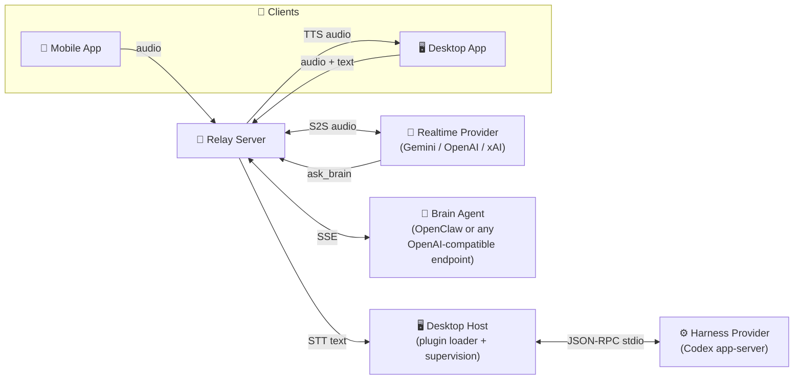

# VoiceClaw

[](LICENSE)
[](https://www.typescriptlang.org/)
[](https://nodejs.org/)
[](relay-server/Dockerfile)

Open-source, Harness-neutral framework for composable Agent voice interaction across devices.

VoiceClaw combines a Relay server, a Desktop Host, and Clients (desktop/mobile) through a trusted Plugin Kernel. Realtime voice models handle conversation; coding-agent Harnesses (Codex, Claude Code, …) do the real work. Harnesses stay peer integrations delivered as plugin packages — VoiceClaw is not a downstream distribution of any one agent.

## Demo

Watch VoiceClaw as a thinking partner for real-time problem solving:

[](https://youtu.be/iAS7vj2vRaA?si=oelgIdETS8iWTavV)

## Conversation pipelines

A session selects one of three explicit pipelines (`session.config`):

| Pipeline            | `mode` / `voiceMode`       | What runs the turn                                                                                                                    | Status                     |
| ------------------- | -------------------------- | ------------------------------------------------------------------------------------------------------------------------------------- | -------------------------- |
| **S2S Direct**      | `s2s` / `direct` (default) | A realtime voice model (Gemini Live, OpenAI Realtime, Grok Voice) with direct Relay tools (`read`/`write`/`edit`/`bash`/`web_search`) | Stable                     |
| **S2S Operator**    | `s2s` / `operator`         | The realtime model delegates tasks to a Brain Agent (any OpenAI-compatible endpoint, e.g. OpenClaw) via `ask_brain`                   | Stable                     |
| **STT/TTS Harness** | `stt-tts`                  | Finalized speech is recognized (STT), dispatched to a Desktop-hosted Harness Provider, and the streamed reply is synthesized (TTS)    | Runnable prototype (Codex) |

The STT/TTS Harness path is the current focus: it gives the voice loop a real coding agent with native tools, threads, and workspace ownership instead of a chat-completions facade.

## Architecture



- **Relay** (`relay-server/`) — independently deployable Node.js/TypeScript service owning authentication, sessions, pipeline routing, the turn queue, STT/TTS orchestration, and Kernel control state. Never branches on a provider name.
- **Desktop** (`desktop/`) — Electron client plus the **Desktop Host**: it discovers `voiceclaw.plugin.json` packages, loads `provider-integration` Contributions, supervises local Harness processes, and can bundle-run the Relay for a one-machine stack.
- **Plugin Kernel** (Phase 0, spanning Relay and Desktop) — validates plugin manifests, coordinates Contributions, and enforces capability grants, isolation, and generation fencing through the versioned `harness.execution@1` contract (`packages/contracts/`).
- **Mobile** (`mobile/`) — React Native / Expo iOS client paired to a Relay.
- **Brain Agent** — S2S Operator's delegate; any OpenAI-compatible chat-completions endpoint works (a vendored [OpenClaw](https://github.com/yagudaev/openclaw) can be bundled).

### Harness Providers

| Provider                             | Form                                                                                                                                                                                                                                                   | Status                                                                                                                                                      |
| ------------------------------------ | ------------------------------------------------------------------------------------------------------------------------------------------------------------------------------------------------------------------------------------------------------ | ----------------------------------------------------------------------------------------------------------------------------------------------------------- |
| `codex`                              | First-party plugin package (`desktop/src/main/providers/codex/`) speaking Codex app-server JSON-RPC over stdio. Verified against `codex-cli 0.153.4` with a pinned, fingerprinted schema artifact; other versions get a persistent unverified warning. | Prototype accepted; real app-server and voice-loop tests pass; physical microphone, audible TTS, cancellation, and no-replay disconnect acceptance verified |
| `claude-code`                        | HTTP gateway scaffold (legacy `HarnessAdapter` boundary)                                                                                                                                                                                               | Test scaffold only                                                                                                                                          |
| `cherry-studio`, `openai-compatible` | Reserved stable IDs                                                                                                                                                                                                                                    | Planned (`complete-harness-provider-integrations`)                                                                                                          |

### Voice providers (STT/TTS pipeline)

Each boundary is selected independently — a local provider can pair with a cloud one. No provider ever silently falls back to another.

| Boundary | IDs                            | Notes                                                                                                     |
| -------- | ------------------------------ | --------------------------------------------------------------------------------------------------------- |
| STT      | `deepgram`, `gpt-sovits-stt`   | GPT-SoVITS STT runs an operator-supplied local offline ASR (FunASR) per utterance; no partial transcripts |
| TTS      | `elevenlabs`, `gpt-sovits-tts` | GPT-SoVITS TTS calls a local `api_v2.py` HTTP service with reference audio                                |

VoiceClaw never installs or supervises GPT-SoVITS; the operator supplies the checkout and points to it via `GPT_SOVITS_*` environment variables (see [relay-server/README.md](relay-server/README.md)).

## Quick Start

### Prerequisites

- Node.js 20+ (repo CI uses 22) and Yarn (`corepack enable`)
- macOS for packaged desktop builds and iOS; the dev stack also runs on Windows

```bash
git clone https://github.com/chen-zhip/voiceclaw.git
cd voiceclaw
yarn install
```

### One-click local stack (Desktop + bundled Relay + Host)

```bash
yarn dev:local
```

This starts the Desktop app, which spawns and owns the bundled Relay and the Desktop Host, then health-checks `http://127.0.0.1:8080/health` and prints the WebSocket and browser test-page URLs. Realtime provider keys (Gemini / OpenAI / xAI) are entered once in the app's Settings UI, not read from the shell.

### Individual workspaces

```bash
# Standalone relay (reads relay-server/.env — copy .env.example first)
yarn dev:server

# Desktop app only
yarn dev:desktop

# Mobile app (Expo)
yarn dev:mobile

# Relay + desktop + website + tracing together
yarn dev
```

The standalone relay listens on `http://localhost:8080` with a browser test client at `/test`.

### Trying the STT/TTS Harness path (Codex)

1. Install and authenticate the Codex CLI (`codex-cli 0.153.4` is the verified profile).
2. Configure a Native Provider Configuration (workspace path, executable) for the Desktop Host — currently saved via `electronAPI.desktopHost.saveProviderConfiguration` (settings UI is in progress).
3. In Settings, choose voice mode **stt-tts-harness** and fill the Harness provider/workspace/binding IDs plus STT/TTS provider IDs.
4. A bundled stack can also declare defaults through the environment: `VOICECLAW_STT_PROVIDER`, `VOICECLAW_TTS_PROVIDER`, `VOICECLAW_HARNESS_ID` (client values always win; local `gpt-sovits-*` providers are never chosen implicitly).

Set `VOICECLAW_STT_TTS_DEBUG=true` to get stage-by-stage JSON diagnostics for the pipeline ([docs/stt-tts-debug-checkpoints.md](docs/stt-tts-debug-checkpoints.md)). `VOICECLAW_CODEX_SIMULATED=true` swaps the real app-server for a deterministic simulation boundary when debugging without credentials.

## Configuration

The standalone Relay reads `relay-server/.env` (see [.env.example](relay-server/.env.example) for the full annotated list):

| Variable                                                                                              | Purpose                                                        |
| ----------------------------------------------------------------------------------------------------- | -------------------------------------------------------------- |
| `GEMINI_API_KEY` / `OPENAI_API_KEY` / `XAI_API_KEY`                                                   | Realtime S2S provider keys (at least one)                      |
| `RELAY_API_KEY`                                                                                       | Client auth key (required in production)                       |
| `BRAIN_GATEWAY_URL`, `BRAIN_GATEWAY_AUTH_TOKEN`                                                       | Brain Agent endpoint for S2S Operator                          |
| `DEEPGRAM_API_KEY`, `ELEVENLABS_API_KEY`                                                              | Cloud STT/TTS keys                                             |
| `GPT_SOVITS_*`                                                                                        | Local GPT-SoVITS service URL, reference audio, ASR root/python |
| `VOICECLAW_STT_PROVIDER`, `VOICECLAW_TTS_PROVIDER`, `VOICECLAW_HARNESS_ID`                            | STT/TTS pipeline component defaults                            |
| `VOICECLAW_SHIPPED_PLUGIN_ROOTS`, `VOICECLAW_HARNESS_PACKAGE_ID`, `VOICECLAW_HARNESS_CONTRIBUTION_ID` | Harness plugin package discovery and selection                 |
| `LANGFUSE_*`, `TRACING_UI_COLLECTOR_URL`                                                              | Optional per-turn tracing                                      |
| `TAVILY_API_KEY`                                                                                      | Optional `web_search` tool                                     |

## Project structure

```
voiceclaw/
  relay-server/        WebSocket relay: sessions, pipelines, STT/TTS, plugin kernel, host gateway
  desktop/             Electron client + Desktop Host + first-party provider packages (codex)
  mobile/              React Native (Expo) iOS client
  packages/contracts/  @voiceclaw/contracts — manifest v0, kernel envelope, harness.execution@1
  website/             Next.js site (distribution + optional accounts)
  docs/                Astro/Starlight docs site, ADRs, architecture boundary guide
  tracing-collector/   Local OTLP receiver → SQLite
  tracing-ui/          Local trace explorer (Next.js, port 4319)
  agent/               Brain-agent plugins/config (OpenClaw, Hermes)
  openspec/            Spec-driven change workflow: specs, active changes, archive
  vendor/openclaw      Git submodule — bundled Brain Agent
```

## Development

- **Spec-driven workflow** — formal changes go through [OpenSpec](openspec/config.yaml): proposal → specs → design → tasks, TDD per task, strict validation before archive. Active and archived changes live under `openspec/changes/`.
- **Domain language** — terminology is governed by [CONTEXT-MAP.md](CONTEXT-MAP.md), per-workspace `CONTEXT.md` files, and ADRs under `docs/adr/`. The normative responsibility boundary is [docs/architecture/voiceclaw-harness-boundary.md](docs/architecture/voiceclaw-harness-boundary.md).
- **Checks** — `yarn typecheck:all`, `yarn workspace relay-server test`, `yarn workspace voiceclaw-desktop test`. Opt-in real-system tests (Codex app-server, GPT-SoVITS) skip themselves unless their runtime is present.
- **Conventions** — TypeScript, no semicolons, Conventional-Commit PR titles (squash-merged, release-please). See the [contributing docs](https://docs.getvoiceclaw.com/contributing/).

## Status

Prototype critical path (each stage archived in `openspec/changes/archive/` when done):

1. ✅ Plugin Kernel Phase 0 (`packages/contracts`, manifest validation, grants, fencing)
2. ✅ Desktop Harness Host contract (host enrollment, native provider configuration, readiness)
3. ✅ Harness Execution Routing (turn/attempt/thread mapping, streaming, cancel, outcome-unknown)
4. 🔄 Codex provider prototype — implementation and opt-in real app-server e2e complete; the physical microphone → Codex → TTS acceptance journey is the remaining gate
5. 🔄 Local GPT-SoVITS voice providers — implemented; real synthesis/recognition and audible Desktop playback verified

Archive/Memory feature plugins, multi-provider convergence (Claude Code, OpenAI-compatible, Cherry Studio), history import, and native TUI handoff are deferred follow-up changes. Without Archive, conversations live only in the current Relay session.

## Contributing

1. Fork the repo and create a feature branch from `main`
2. Make your changes (one focused feature or fix per PR)
3. Open a pull request against `main` with a Conventional-Commit title

## License

[MIT](LICENSE)
